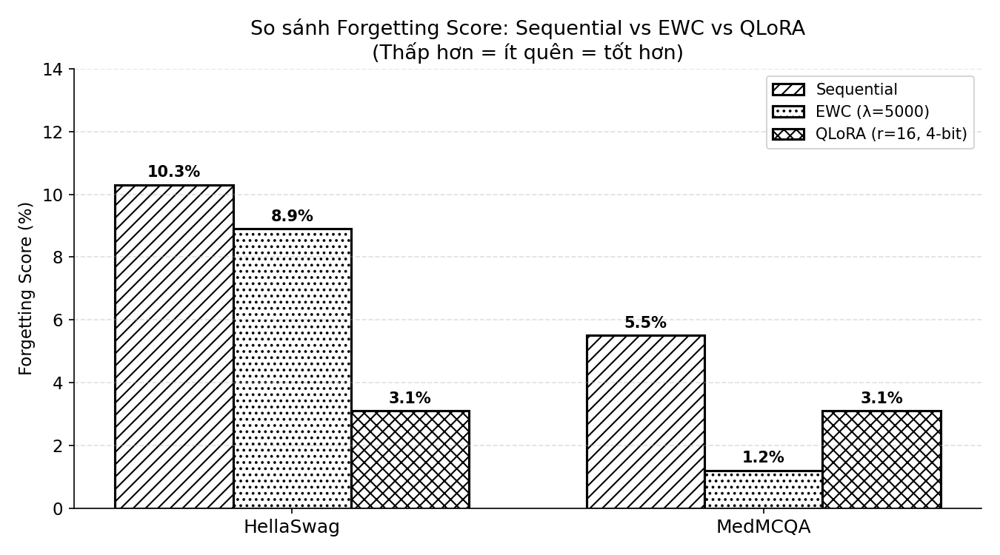

# 🧠 Catastrophic Forgetting in Continual Fine-tuning of LLMs

**Phân tích hiện tượng Catastrophic Forgetting khi fine-tune LLM trên nhiều task liên tiếp**
*(Analyzing Catastrophic Forgetting when fine-tuning LLMs on multiple sequential tasks)*

[](https://github.com/pvmahn)
[](https://www.kaggle.com/code/phamvanmanh/demo-project)
[](https://www.kaggle.com/datasets/phamvanmanh/cf-models)
[](LICENSE)

---

## 📌 Giới thiệu
*(Overview)*

**Vấn đề:** Khi fine-tune một LLM trên nhiều task liên tiếp, model có xu hướng **quên kiến thức cũ** sau khi học task mới — hiện tượng này gọi là **Catastrophic Forgetting (CF)**.
*(**Problem:** When fine-tuning an LLM on multiple sequential tasks, the model tends to **forget previous knowledge** after learning new tasks — this phenomenon is called **Catastrophic Forgetting (CF)**.)*

---

## 🎮 Demo

[](https://www.kaggle.com/code/phamvanmanh/demo-project)

**Cách chạy:**
*(How to run:)*

1. Vào link Kaggle notebook ở trên *(Open Kaggle notebook link above)*
2. Bấm **Run All** *(Click **Run All**)*
3. Link Gradio xuất hiện ở cell cuối *(Gradio link appears in last cell)*
4. Click link → Demo tương tác! *(Click link → Interactive demo!)*

---

## 🔬 Thực nghiệm
*(Experiment)*

Fine-tune **GPT-2 Medium (345M params)** trên 3 task theo thứ tự:
*(Fine-tune **GPT-2 Medium (345M params)** on 3 tasks sequentially:)*

```
Task 1: HellaSwag  → Commonsense Reasoning (suy luận thông thường)
Task 2: MedMCQA   → Medical Question Answering (hỏi đáp y tế)
Task 3: SST-2     → Sentiment Analysis (phân tích cảm xúc)
```

So sánh **3 phương pháp** giảm Catastrophic Forgetting:
*(Comparing **3 methods** to reduce Catastrophic Forgetting:)*

| Phương pháp *(Method)* | Cơ chế *(Mechanism)* | Tham số train *(Trainable params)* |
|-------------|--------|--------------|
| 🔴 Sequential | Train thẳng, không bảo vệ *(No protection)* | 345M (100%) |
| 🔵 EWC (λ=5000) | Fisher Information Matrix bảo vệ tham số quan trọng *(Protects important weights)* | 345M (100%) |
| 🟣 QLoRA (r=16, 4-bit NF4) | Đóng băng GPT-2 gốc + train adapter nhỏ *(Freeze GPT-2 + small adapter)* | 4.3M (1.21%) |

---

## 📊 Kết quả
*(Results)*



### HellaSwag (Task 1) — Commonsense Reasoning

| Phương pháp *(Method)* | Trước CF *(Before CF)* | Sau CF *(After CF)* | Forgetting Score |
|-------------|---------|--------|-----------------|
| 🔴 Sequential | 30.9% | 20.6% | **10.3%** ❌ |
| 🔵 EWC | 32.7% | 23.8% | **8.9%** ✅ |
| 🟣 QLoRA | 27.3% | 24.2% | **3.1%** 🏆 |

### MedMCQA (Task 2) — Medical QA

| Phương pháp *(Method)* | Trước CF *(Before CF)* | Sau CF *(After CF)* | Forgetting Score |
|-------------|---------|--------|-----------------|
| 🔴 Sequential | 54.3% | 48.8% | **5.5%** ❌ |
| 🔵 EWC | 47.2% | 46.0% | **1.2%** 🏆 |
| 🟣 QLoRA | 59.3% | 56.2% | **3.1%** ✅ |

### SST-2 (Task 3) — Sentiment Analysis

| Phương pháp *(Method)* | Accuracy |
|-------------|---------|
| 🔴 Sequential | 90.48% |
| 🔵 EWC | 91.86% |
| 🟣 QLoRA | 90.6% |

> **Forgetting Score** = Accuracy trước CF - Accuracy sau CF. Càng thấp → càng ít quên → càng tốt!
> *(Forgetting Score = Accuracy before CF - Accuracy after CF. Lower = less forgetting = better!)*

### 🏆 Kết luận
*(Conclusion)*

- **QLoRA** đạt Forgetting Score thấp nhất trên HellaSwag (**3.1%**) nhờ đóng băng 345M tham số gốc, chỉ train adapter 4.3M params
*(**QLoRA** achieves lowest Forgetting Score on HellaSwag (**3.1%**) by freezing 345M original params, only training 4.3M adapter params)*

- **EWC** đạt Forgetting Score thấp nhất trên MedMCQA (**1.2%**) nhờ Fisher Matrix bảo vệ tham số quan trọng
*(**EWC** achieves lowest Forgetting Score on MedMCQA (**1.2%**) thanks to Fisher Matrix protecting important weights)*

- **Sequential** bị CF nặng nhất trên cả 2 task
*(**Sequential** suffers the most CF on both tasks)*

- Không có phương pháp nào chiến thắng tuyệt đối — hiệu quả phụ thuộc vào đặc điểm từng task
*(No single method wins on all tasks — effectiveness depends on task characteristics)*

---

## 🛠️ Tech Stack

| Thành phần *(Component)* | Chi tiết *(Details)* |
|-----------|---------|
| Model | GPT-2 Medium (345M params) |
| Framework | PyTorch + HuggingFace Transformers |
| PEFT | QLoRA (bitsandbytes 4-bit NF4, rank=16) |
| EWC | Fisher Information Matrix (λ=5000) |
| Datasets | HellaSwag, MedMCQA, SST-2 |
| Demo | Gradio |
| GPU Train | Kaggle Tesla T4 16GB |
| Số mẫu train *(Train samples)* | 10,000 / task |
| Số mẫu eval *(Eval samples)* | 1,000 / task |

---

## 📁 Cấu trúc project
*(Project Structure)*

```
catastrophic-forgetting-llms/
│
├── config.py              # Cấu hình chung (paths, hyperparams) (General configuration)
│                     
├── dataset_loader.py      # Tải và tiền xử lý tập dữ liệu (Load & preprocess datasets)
│
├── train.py               # Train Sequential
├── train_ewc.py           # Train EWC
├── train_qlora.py         # Train QLoRA (4-bit)
│
├── main.py                # Chạy Sequential pipeline (Run Sequential pipeline)
├── main_ewc.py            # Chạy EWC pipeline (Run EWC pipeline)
├── main_qlora.py          # Chạy QLoRA pipeline (Run QLoRA pipeline)
│
├── evaluate.py            # Đánh giá & tính Forgetting Score (Evaluate & compute Forgetting Score)
│                          
├── plot.py                # Vẽ biểu đồ so sánh (Plot comparison charts)
│
├── demo_cf.py             # Gradio demo tương tác (Interactive demo)
├── requirements.txt       # Thư viện cần thiết (Dependencies)
├── README.md              # Tài liệu project (Project documentation)
│
├── results/               # Kết quả thực nghiệm (Experiment results)
│   ├── comparison_3methods.csv
│   ├── seq_accuracy_table.csv
│   ├── ewc_accuracy_table.csv
│   ├── qlora_accuracy_table.csv
│   ├── seq_forgetting_scores.csv
│   ├── ewc_forgetting_scores.csv
│   └── qlora_forgetting_scores.csv
│
└── figures/               # Biểu đồ kết quả (Result charts)
    └── compare_forgetting_3methods.png
```

> **Lưu ý:** Thư mục `data/` và `models/` không được upload lên GitHub do giới hạn dung lượng. Checkpoint (~8GB) có tại: [Kaggle Dataset](https://www.kaggle.com/datasets/phamvanmanh/cf-models)
>
> *(Note: `data/` and `models/` are not uploaded to GitHub due to size limitations. Checkpoints (~8GB) available at: [Kaggle Dataset](https://www.kaggle.com/datasets/phamvanmanh/cf-models))*

---

## 🚀 Cách chạy
*(How to Run)*

### 1. Cài đặt
*(Installation)*

```bash
pip install -r requirements.txt
```

### 2. Train models


```bash
# Sequential Fine-tuning
python main.py

# EWC
python main_ewc.py

# QLoRA (cần GPU với bitsandbytes trên Linux) (Requires GPU with bitsandbytes on Linux)
python main_qlora.py
```

### 3. Đánh giá
*(Evaluate)*

```bash
python evaluate.py
```

### 4. Vẽ biểu đồ
*(Plot results)*

```bash
python plot.py
```

### 5. Chạy Demo
*(Run Demo)*

```bash
python demo_cf.py
```

> ⚠️ Demo yêu cầu internet để load dataset từ HuggingFace.
> *(Demo requires internet to load datasets from HuggingFace.)*
>
> ⚠️ QLoRA không hỗ trợ đầy đủ trên Windows (bitsandbytes). Khuyến nghị chạy trên Linux/Kaggle.
> *(QLoRA is not fully supported on Windows (bitsandbytes). Recommended to run on Linux/Kaggle.)*

---

## ⚙️ Hyperparameters

| Tham số *(Parameter)* | Giá trị *(Value)* |
|-----------|-------|
| Model | GPT-2 Medium |
| Batch size | 8 |
| Learning rate | 2e-5 |
| Epochs | 3 |
| Số mẫu train tối đa *(Max train samples)* | 10,000 / task |
| Số mẫu eval tối đa *(Max eval samples)* | 1,000 / task |
| EWC Lambda (λ) | 5,000 |
| QLoRA rank (r) | 16 |
| QLoRA alpha | 32 |
| QLoRA quantization | 4-bit NF4 |
| QLoRA tham số train được *(trainable params)* | 4.3M (1.21%) |

---

## 📄 Giấy phép
*(License)*

MIT License — xem chi tiết tại *(see details at)* [LICENSE](LICENSE).

---

<div align="center">

**pvmahn** | 2026

[](https://github.com/pvmahn)
[](https://www.kaggle.com/code/phamvanmanh/demo-project)

</div>